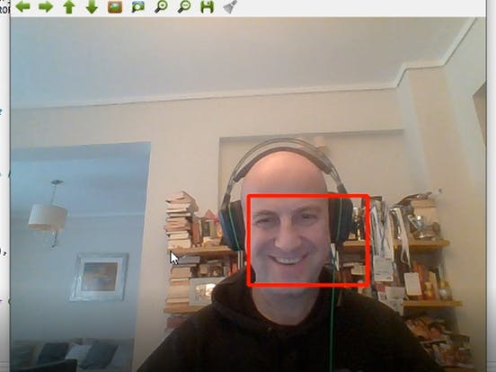
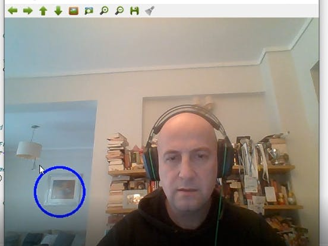
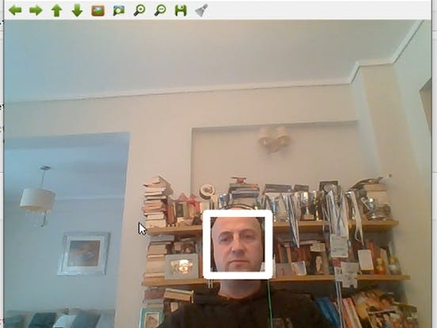

# face_detector-opencv

Here I made a project to show how to connect to your computer's camera, open it, record yourself or something, save it, open the video file you have saved, draw on live video, interact on live video and at the end do Face Detection. Then draw a rectangle bounding box for the image, a circle on other objects. Here is some image from output cell     

